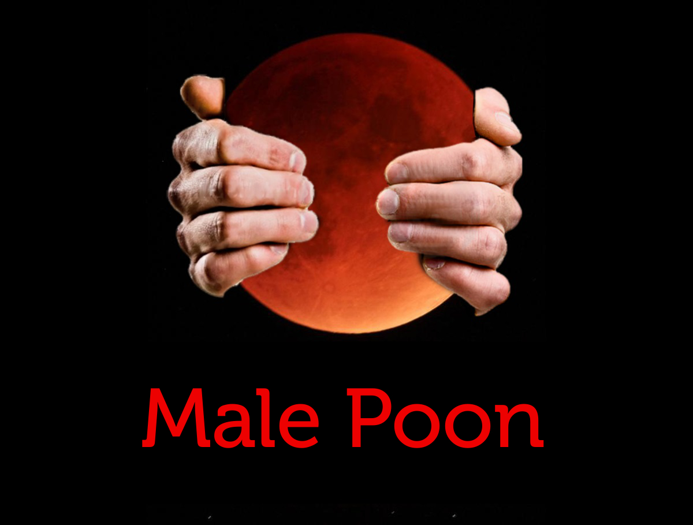

# Male Poon web browser

This is the source code for the Male Poon web browser, a nice poon browser derived from MoonchildProductions' Pale Moon/UXP code. The source tree is
laid out in a "comm-central" style configuration where only the code specific to our beloved Male Poon is kept in this repository.

The shared Unified XUL Platform-Fixed source code is referenced here as a git submodule contained in the `platform/` directory and is required to build the application.

Note: I have removed all proprietary Pale Moon branding. As such, this repository does not violate any copyrights imposed by Moonchild Productions. Any copyright claims submitted against this repo are false. In addition, the rights to the MPL licensed Pale Moon code cannot be revoked from me as it is very clear which commit corresponds to each Linux binary.

## Changes compared to Pale Moon:
* Branding changed from Pale Moon to Male Poon. kek.
* Restore dual GUID system/Firefox addons support
* Revert removal of ability to set extension update background URL (in case someone else starts their own addon site)
* Restore support for system libvpx
* Restore support for system sqlite (I don't recommend using this.)
* Restore support for system NSPR/NSS
* Restore support for system ICU (this breaks on newer ICU versions)
* Removal of Tobin's precious directive 4 (you can use official branding and system libs at the same time now)

## FAQ
* Doesn't this violate Moonchild Productions' branding and copyrights?
    * No. Moonchild Productions owns (but has not legally registered) the copyright for Moonchild Productions and Pale Moon. He does not own the copyright for Male Poon, nor the copyright for ManchildProductions. On the Pale Moon forum Tobin claims that the blood moon logo cannot be used, even in goatse form. I am not using the blood moon logo from the Pale Moon repo. I am using a different picture of a blood moon pulled off of Google Images that is completely unrelated to their blood moon logo/branding. The font they used for the Pale Moon logo allows free commercial use. As such, I am not in violation of any branding. I'd be happy to take them to court to prove otherwise. I have the time and money to do so.
* Will you be providing binaries?
    * There are Linux x86_64 binaries under the Actions tab. For x86_64 Linux, these should be considered the official upstream binaries. There is a GitHub Action for Windows but it is currently broken. If you have the knowledge to help fix this, please do so as I don't/won't use Windows.
    * In addition to the Linux binaries produced by GitHub Actions, @SneedSoft has also volunteered to compile binaries for i686 and x86_64 Linux, as well as 32 and 64 bit Windows. These can be downloaded from http://pajeet.tech/malepoon/
* Where should we look if your GitHub profile gets banned due to false GitHub reports from people on the Pale Moon forums?
    * If this happens I will create a thread on 4chan's /g/ board with info on the new Git host and repo. Ideally this would not happen as I am not violating any GitHub policies that I am aware of.
* Will you provide any sort of Linux package?
    * I won't be providing any package for any binary distros. I probably will create a Gentoo package. Since I'm not using Pale Moon's branding I'm not subject to the retarded Pale Moon redistribution policies. If you want a binary use the ones in the Actions tab. They are compiled in a distro-agnostic way so they should work as long as your distro has a recent glibc.

## Code of Conduct
* This project is maintained under the Geek Feminism code of conduct, after you copy and paste it into notepad and then clear the entire document. In other words, there is no code of cuckduct.
* In addition to the previous point, by using and/or contributing to this software, you agree not to open GitHub issues for bullshit licensing violations or any other autistic reasons.

## Credits:
* MoonchildProductions for the wonderful Pale Moon Browser and UXP platform.
* Credits also go to Pale Moon and UXP contributors for the same reason as above.
* Palemoon.org forum users for continuing to report my profile. GitHub support has notified me that they will take note of the abuse of the GitHub reports feature and will act accordingly.
* mattatobin for continuing to complain about GitHub forks he doesn't like.

## Getting the platform sub-module
`git submodule init && git submodule update`

## Resources
TODO - Update these/golive with malepoon.org
 * [Build Pale Moon for Windows](https://developer.palemoon.org/build/windows/)
 * [Build Pale Moon for Linux](https://developer.palemoon.org/build/linux/)
 * [Pale Moon home page](http://www.palemoon.org/)
 * [Code of Conduct, Contributing, and UXP Coding style](https://repo.palemoon.org/MoonchildProductions/UXP/src/branch/master/docs)
